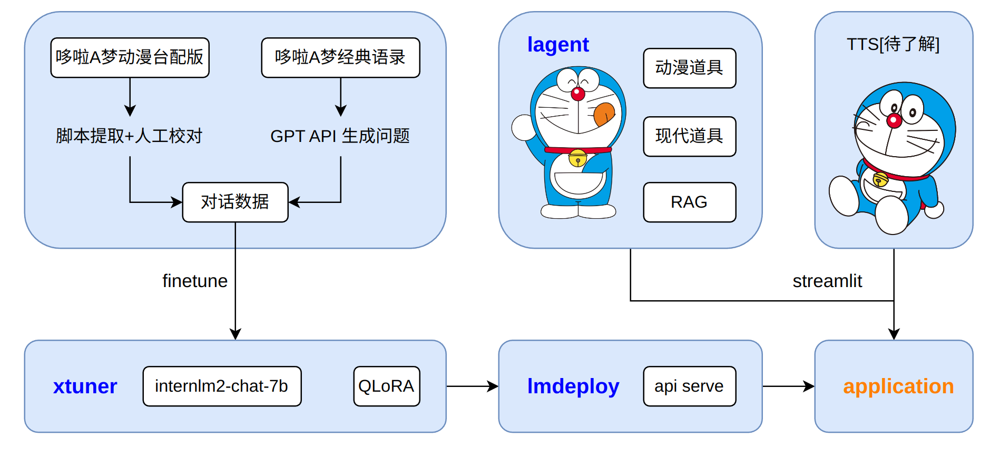

# chat-doraemon

## 项目概述

本项目旨在创建一个基于哆啦A梦形象的桌面萌宠，通过大模型及其他相关技术使其能够与用户进行互动。该萌宠将具备哆啦A梦的语气和个性，并能够通过“四次元口袋”提供丰富的功能。项目计划使用微调大语言模型、Agent系统、检索增强生成（RAG）技术、TTS、Agent微调来实现这一目标。前端呈现考虑使用Unity，短期内将优先使用Gradio或Streamlit展示相关成果。

## 项目架构

## 技术路线

### 数据

* 对话数据：

  - 大山版台配陈美贞剧集提取

  - 根据“经典语录”生成问题

* 个人信息数据：用于`agent: “rag“道具`

* 经典道具数据：用于`agent: 动漫道具`

### 微调

- 语气个性微调
- agent微调

### agent

- 动漫道具：例如竹蜻蜓
- “rag“道具：辅助llm回答，例如用户询问关于“哆啦美喜欢吃什么”的时候会进行相应检索，减少llm回答的错误率
- 现代道具：例如文生图

### TTS

* 初步锁定GPT-SoVITS

### 前端

* 短期内考虑gradio/streamlit
* 长期考虑unity

## 进展

- [x] 数据：经典道具数据：2024/05/20
- [x] agent：动漫道具：2024/05/23

## 参考

### 数据

mp4文件提取对话：

https://github.com/LC1332/Chat-Haruhi-Suzumiya/tree/main/yuki_builder

相关人物和工具词条：

https://doraemon.fandom.com/zh/wiki/%E9%A6%96%E9%A0%81?utm_source=fandom-explore-zh

https://duola.huijiwiki.com/wiki/%E8%A7%92%E8%89%B2%E5%88%97%E8%A1%A8

https://baike.baidu.com/item/%E5%93%86%E5%95%A6A%E6%A2%A6/185384

### agent

动漫道具：

https://github.com/LC1332/Chat-Haruhi-Suzumiya/blob/main/notebook/Doraemon_Agent.ipynb

agent实现：

https://github.com/InternLM/lagent

## 致谢

感谢**书生浦语**

